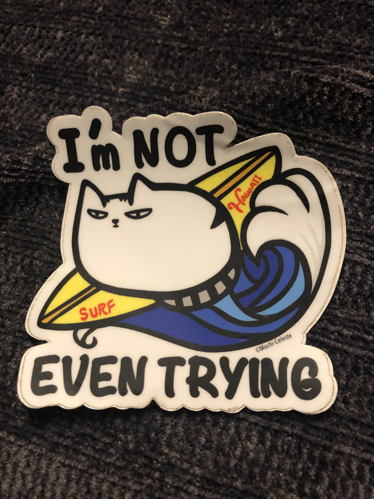

# Gallery - capture physics with your phone

I'm delighted to present here moments of physical phenomenon captured by you! 

Email me shuwent@ldeo.columbia.edu pictures (waves, eddies, hydraulics, turbulence, anything fluid mechanics!) with the title of the picture, key physics, a short description if you wish, and your name to win this sticker $\searrow$



```{tableofcontents}
```
